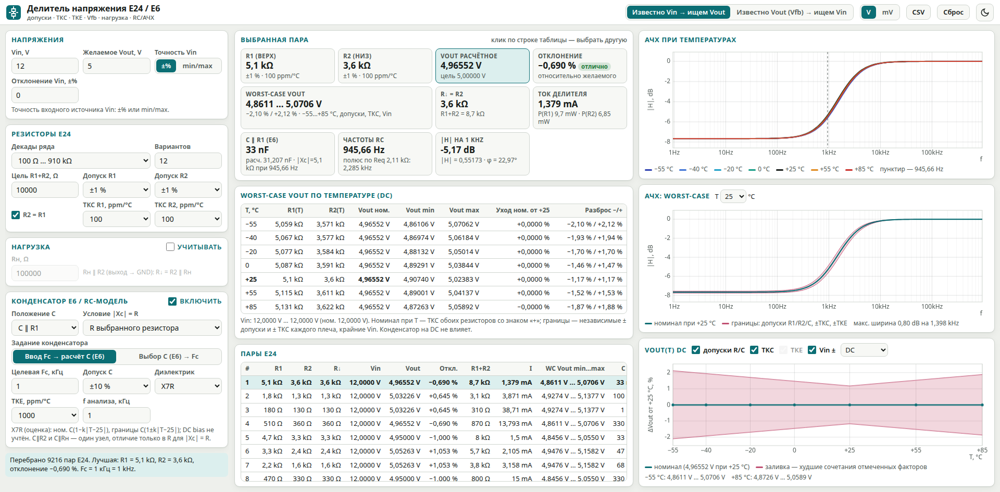
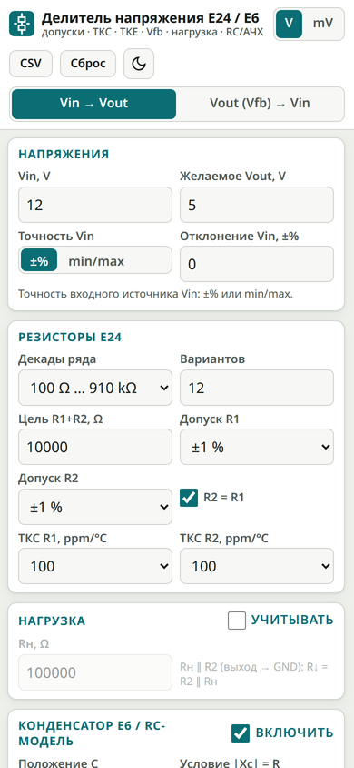
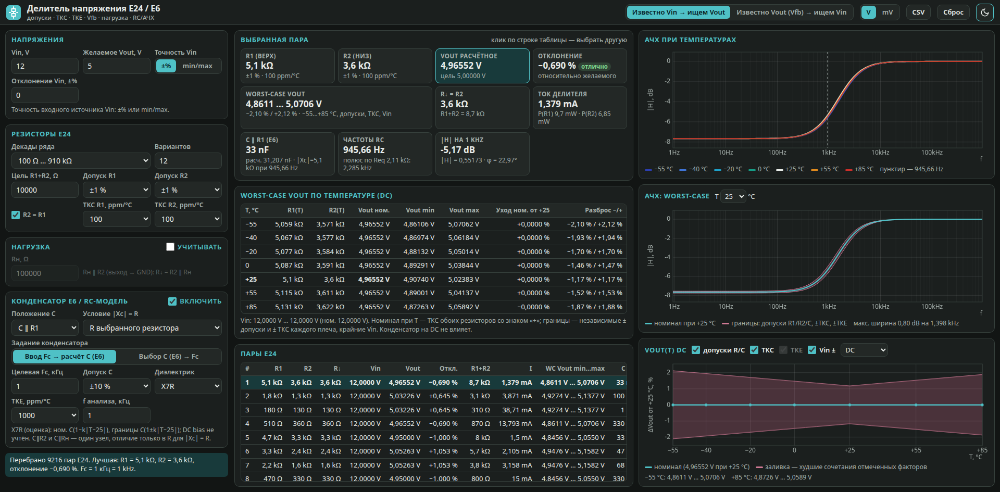

# Делитель напряжения E24 / E6

Автономный инженерный калькулятор резистивного делителя и делителя обратной связи (Vfb): подбор пар **E24**, конденсатор **E6**, worst-case по допускам, ТКС, ТКЕ и точности Vin/Vfb, температурные графики АЧХ.

| | |
|---|---|
| **Веб-версия** | https://wadi-li.github.io/scientific-voltage-divider-e24-e6/ |
| **Android APK** | [dist/voltage-divider-e24-e6-1.0.apk](dist/voltage-divider-e24-e6-1.0.apk) (Android 7.0+, офлайн) |
| **Версия** | 1.0 — см. [CHANGELOG.md](CHANGELOG.md) |



<p align="center"> &nbsp; </p>

## Возможности

- Режимы **Vin → Vout** и **Vout (Vfb) → Vin**; единицы V / mV, шаг 0,05 V / 50 mV.
- Точность известного напряжения: **±%** или **min / nom / max** из datasheet.
- Резисторы E24: выбор декад, цель R1+R2, допуски R1/R2 0,05…5 %, ТКС 15/50/75/100/200/500 ppm/°C.
- Отключаемая нагрузка Rн ∥ R2.
- Конденсатор E6: C ∥ R1, C ∥ R2, C ∥ Rн; ввод Fc (кГц) → C или выбор C → Fc; условие |Xc| = R выбранного резистора или Req; допуск C; C0G / X7R.
- Worst-case таблица при −55, −40, −20, 0, +25, +55, +85 °C.
- Графики: АЧХ по температурам; АЧХ worst-case с заливкой при выбранной T; искомое напряжение от температуры (относительная шкала, чекбоксы допусков, ТКС, ТКЕ, Vin/Vfb; DC или частота анализа).
- Таблица пар E24 (клик — выбор пары), экспорт CSV (`;`, UTF-8 BOM), сохранение введённых данных.
- Один экран Full HD; вертикальная компоновка для телефона; светлая тема по умолчанию и тёмная по переключателю.

Файл `index.html` полностью автономный: без CDN и внешних шрифтов, графики — встроенный Canvas. Можно открыть локально двойным щелчком.

## Модель и ограничения

- `Vout = Vin · R↓ / (R1 + R↓)`, `R↓ = R2 ∥ Rн`; в режиме обратной связи `Vin = Vfb · (R1 + R↓) / R↓`.
- `R(T) = R₂₅ · (1 + ТКС · 10⁻⁶ · (T − 25))`. Номинал — ТКС обоих резисторов со знаком «+»; границы — независимые ± допуски и ± ТКС каждого плеча и крайние Vin/Vfb (перебор углов).
- C0G: номинал без ухода, границы ±30 ppm/°C. X7R — инженерная оценка: номинал `C·(1 − k·|T−25|)`, границы `C·(1 ± k·|T−25|)`; DC bias, старение и частотная зависимость MLCC не учитываются.
- Не учитываются ток входа FB, утечки, саморазогрев резисторов и шум опорника.

## Структура репозитория

```
index.html            калькулятор (веб-версия и содержимое APK)
android/              исходники Android-оболочки WebView
  AndroidManifest.xml
  src/…/MainActivity.java
  res/                иконки, строки, тема
  build.sh            сборка без Gradle
dist/                 готовые APK
docs/                 скриншоты и иконка
CHANGELOG.md          история версий
```

## Сборка Android

Сборка без Gradle: `aapt2 → javac → d8 → zipalign → apksigner`. Нужны Android build-tools 34, platform android-34, JDK 17 и собственный keystore (в репозиторий не входит):

```sh
KS=/путь/к/keystore.jks KSP=пароль VN=1.0 VC=1 ./android/build.sh
```

Скрипт копирует `index.html` в assets и кладёт подписанный APK в `dist/`.

Приложение проверено сборкой и подписью; запуск на реальном устройстве не проверялся.
